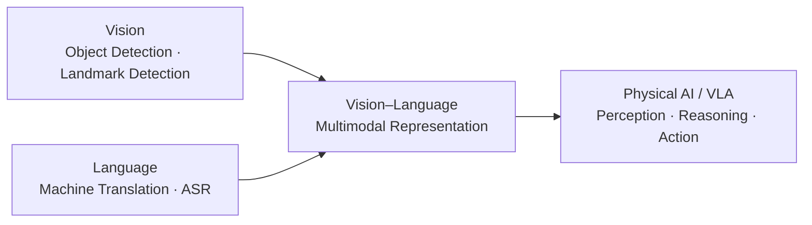

# Trần Đỗ Mạnh Duy

**AI Researcher / Research Engineer**  
Software Engineering @ Posts and Telecommunications Institute of Technology (PTIT)

I am interested in building AI systems from first principles and understanding the mechanisms behind them — representation, information flow, optimization, training dynamics, inference, and failure modes.

My current research direction moves from **modality-specific systems** toward **multimodal and physical intelligence**:



I believe that building stronger AI capability is not only about using larger pretrained models. It also requires understanding how representations are formed, what information is lost during alignment, how objectives shape the learned space, and where a system fails when moved from a controlled benchmark to the physical world.

---

## Current focus

### InA-Bridge — Vision–Language Pretraining

My main ongoing project is a query-based vision–language architecture designed to separate **visual perception** from **language alignment**.

**Target architecture**

```text
DINOv3 ViT-L/16
    ↓ dense visual features
Q-Former
    ↓ learned visual queries
Projector
    ↓ LLM embedding space
Qwen3-4B
```

The Q-Former uses **128 learned visual queries**, custom cross-attention, separate query/text feed-forward paths, and objective-specific attention masks.

Stage 1 combines three objectives:

- **ITC — Image–Text Contrastive Learning** for representation alignment.
- **ITM — Image–Text Matching** for fine-grained pair discrimination.
- **ITG — Image-Grounded Text Generation** for causal generation conditioned on visual queries.

The training system also includes:

- multi-positive contrastive targets for multiple captions of the same image;
- max-over-query similarity;
- an **EMA momentum teacher** with soft-target distillation;
- an image-ID-aware **MoCo-style memory queue**;
- similarity-weighted **hard-negative mining**;
- objective-aware gradient accumulation;
- mixed precision, gradient clipping, AdamW, and warmup–cosine scheduling.

The current Stage-1 pipeline is still being scaled. Local experiments are used to validate the training mechanics, while full DINOv3 integration and distributed training with **FSDP / ZeRO-3** are the next steps.

A central research question behind the project is:

> Should vision be aligned with language as early as possible, or should a system first preserve a richer non-linguistic visual representation and learn language alignment through a separate bridge?

---

## Featured projects

### 1. English → Vietnamese Neural Machine Translation

A complete end-to-end NMT system covering **data construction → representation → training → decoding**.

**Data**
- More than **35M documented sentence pairs** from multiple corpora.
- Text normalization, pair deduplication, token-length and length-ratio filtering.
- **fastText** language identification.
- **LaBSE** semantic filtering for source–target consistency.
- 40K-piece **SentencePiece Unigram** vocabulary.

**Model**
- **94.76M-parameter Transformer**.
- 6 encoder + 6 decoder layers.
- `d_model = 640`, 8 attention heads.
- Pre-RMSNorm architecture.
- PyTorch SDPA-based attention.
- Shared source / target / output embeddings.

**Training & inference**
- teacher forcing;
- causal and padding masks;
- token-level cross-entropy with label smoothing;
- AdamW, gradient accumulation, clipping, warmup–cosine scheduling;
- resumable checkpoints;
- custom batched beam search with EOS handling, length penalty, KV cache, and beam-parent cache reordering.

A stored checkpoint records **215K+ optimizer updates**. The repository reports **COMET 0.725 on EVBCorpus 2.0**.

One of the most useful lessons from this project came from inference debugging: cached decoding is only correct if positional state and beam-dependent cache state remain consistent with full-prefix causal decoding. Building the decoder exposed how a system can fail at inference even when the trained Transformer itself is correct.

---

### 2. YOLOv10-Style Object Detection & Transfer Learning

A detector implemented directly in PyTorch to study object detection below the framework/API layer.

**Architecture**
- C2f / CIB / SCDown / SPPF-style backbone blocks.
- Bidirectional **PAFPN** multi-scale feature fusion.
- Three-scale decoupled classification / regression heads.
- Independent **one-to-many** and **one-to-one** branches for end-to-end / NMS-free prediction.

**Assignment & objectives**
- Task-Aligned Assignment using classification confidence and CIoU-based localization quality.
- Candidate-in-box filtering and top-k positive selection.
- Quality-weighted soft targets.
- **BCE classification loss + CIoU regression loss + Distribution Focal Loss (DFL)**.

**Training**
- Objects365-derived pretraining.
- COCO fine-tuning.
- AdamW, AMP, FP32 assignment/loss computation, gradient clipping, EMA, warmup–cosine scheduling.
- Staged transfer learning with controlled backbone/neck unfreezing and BatchNorm freezing.

**Deployment**
- Split backbone-neck/head ONNX export.
- Backbone-only export option.
- Precision-aware export paths.
- NMS-free runtime with coordinate restoration and top-k prediction filtering.

A stored EMA evaluation reports **37.04% mAP50-95 on COCO validation**.

The project also became a study of failure modes: early precision improved faster than recall, while small-object / P3 behavior remained a bottleneck. That pushed the analysis toward feature-scale sensitivity, assignment behavior, and augmentation rather than treating the final metric as a black box.

---

## Other work

### Vietnamese Automatic Speech Recognition
- ~5,292 hours of audio and ~1.35M processed samples.
- 16 kHz mono preprocessing and 80-bin log-Mel spectrograms.
- Conv1D acoustic frontend with temporal downsampling.
- 145.2M-parameter Transformer encoder-decoder.
- Autoregressive decoding with cross-attention rather than CTC.
- Batched beam search with KV caching.
- Reported **WER: 13.75%**.

### Landmark Detection / Driver State Perception
I also work on fine-grained visual representations for face, eye, mouth, and driver-state analysis, including transfer learning from object-detection backbones, landmark regression, temporal modeling, and feature-level optimization.

---

## How I approach research

I try to work through four layers:

```text
Build → Understand → Diagnose → Experiment
```

**Build**  
Implement enough of the system to control the important mechanisms instead of treating the model as a black-box API.

**Understand**  
Trace information flow, objectives, gradients, representation bottlenecks, memory/compute trade-offs, and inference state.

**Diagnose**  
Treat failures as information. A model that does not work is useful if the failure can be localized to data, representation, optimization, architecture, or inference.

**Experiment**  
Use controlled ablations and measurable hypotheses rather than adding complexity without knowing what changed.

---

## Research direction

My long-term direction is **multimodal intelligence → Vision–Language–Action → Physical AI**.

The transition from digital AI to physical systems changes the problem substantially. A physical agent must do more than recognize an object or generate a description. It must preserve geometry, spatial relations, object state, temporal context, uncertainty, and information that may never appear in natural-language supervision.

This is why I am particularly interested in:

- self-supervised visual representations;
- multimodal representation learning;
- contrastive learning;
- world models and persistent state;
- spatial and temporal reasoning;
- VLM / VLA architectures;
- reinforcement learning for adaptive decision-making;
- efficient distributed training for large multimodal models.

---

## Technology

**Deep Learning / ML**  
PyTorch · Transformers · Computer Vision · Object Detection · NMT · ASR · VLM · Contrastive Learning · Transfer Learning · Metaheuristic Optimization · Reinforcement Learning

**Training / Systems**  
CUDA · AMP/BF16/FP16 · FSDP / ZeRO-3 · EMA · Gradient Accumulation · Distributed Training · ONNX · Docker

**Data / Engineering**  
Hugging Face · SentencePiece · fastText · LaBSE · OpenCV · Linux · Git

**Foundations**  
Linear Algebra · Probability · Optimization · Algorithms · Python · C/C++ · SQL

---

## Motivation

Looking toward Vietnam's development goals for 2045, I believe that a high-income economy cannot rely indefinitely on low-cost labor or remain concentrated in the final stages of the value chain.

That perspective is one of the strongest motivations behind my research path: to understand, build, and gradually help master core technologies rather than only consume them.

---

## Contact

- **Email:** trandomanhduy2004@gmail.com
- **Location:** Ho Chi Minh City, Vietnam
- **Institution:** Posts and Telecommunications Institute of Technology (PTIT)

> I am currently looking for opportunities to work on difficult AI problems where implementation depth, research thinking, and system-level understanding matter.
